# 5 Linux网络编程基础API

- socket地址API。

​	socket最开始的含义是一个IP地址和端口对（ip，port）。它唯一的标识了使用TCP通信的一端。

- socket基础API。

  socket基础的API都定义在`sys/socket.h`头文件中，包括创建socket、命名socket、监听socket、接受连接、发起连接、读写数据、获取地址信息、检测带外标记，以及读取和设置socket选项。

- 网络信息API。

  linux提供了一套网络信息API，以实现主机名和IP地址之间的转换，以及服务名称和端口号之间的转换。这些API都定义在`netdb.h`头文件中。

## 5.1 socket地址API

### 5.1.1 主机字节序和网络字节序

字节序问题：一个整数（4字节）在内存中排列的顺序将影响它被累加器装载成整数的值。

字节序分类：

- 大端字节序（big endian）：整数的高字节存储在内存的低地址处，符合人类阅读习惯。
- 小端字节序（little endian）：整数的高字节存储在内存的高地址处。

如何判断机器字节序：

```C++
#include<iostream>

using namespace std;

void byteOrder(){
    union{
        short val;
        char union_bytes[sizeof(val)];
    } test;
    test.val = 0x0102;

    if (test.union_bytes[0] == 1 && test.union_bytes[1] == 2){
        cout << "big endian" << endl;
    }
    else if (test.union_bytes[0] == 2 && test.union_bytes[1] == 1){
        cout << "little endian" << endl;
    } 
    else{
        cout << "unknow..." << endl;
    }
}

int main(){
    byteOrder();
    return 0;
}
```

现代PC大多采用小端字节序，小端字节序也被称为主机字节序。大端字节序也被称为网络字节序，给所有接收数据的主机提供一个正确解释收到的格式化数据的保证。

同一台机器上的两个进程也要考虑字节序的问题，例如：一个由C语言编写，一个由java语言编写，而java虚拟机采用的是大端字节序。

linux提供了如下4个函数来完成大端字节序和小端字节序之间(**主机字节序与网络字节序之间**)的转换：

```c++
#include<netinet/in.h>
unsigned long int htonl(unsigned long int hostlong);
unsigned short int htons(unsigned short int hostshort);
unsigned long int utohl(unsigned long int netlong);
unsigned long int utohs(unsigned short int netshort);

// htonl表示“host to network long”，即将长整型的主机字节序数据转为网络字节序数据。
```

四个函数中，**长整数数据通常用来转换IP地址，短整型函数用来转换端口号，在任何格式化的数据通过网络传输时，都应该使用这些函数来转换字节序**。

### 5.1.2 通用socket地址

socket网络编程接口中表示socket地址的是结构体sockaddr。定义如下：

```c++
#include<bits/socket.h>
struct sockaddr
{
	sa_family_t sa_family;
	char sa_data[14];
};
```

**sa_family成员**是地址族类型（sa_family_t）的变量。地址族类型通常与协议族类型对应。常见的协议族（protocol family，也称domain)和对应的地址族：

| 协议族   | 地址族   | 描述             |
| -------- | -------- | ---------------- |
| PF_UNIX  | AF_UNIX  | UNIX本地域协议族 |
| PF_INET  | AF_INET  | TCP/IPv4协议族   |
| PF_INET6 | AF_INET6 | TCP/IPv6协议族   |

宏`PF.*`和`AF.*`都定义在`bits/socket.h`头文件中，两者之间有完全相同的值，通常混用。

**sa_data成员用来存放socket地址值。**

| 协议族   | 地址值含义和长度                                             |
| -------- | ------------------------------------------------------------ |
| PF_UNIX  | 文件的路径名，长度可达到108字节                              |
| PF_INET  | 16bit端口号和32bit IPv4地址，共6字节                         |
| PF_INET6 | 16bit端口号，32bit流标识，128位bit IPv6地址，32bit范围ID，共26字节 |

由于14字节的sa_data根本无法容纳多数协议的地址值，因此，linux定义了下面这个新的通用的socket地址结构体：

```
 #include<bits/socket.h>
 struct sockaddr_storage{
 	sa_family_t sa_family;
 	unsigned long int __ss_align;
 	char __ss_padding[128-sizeof(__ss_align)];
 };
```

该结构体提供足够大的空间用于存放地址值，而且是内存对齐的。

### 5.1.3 专用socket地址

通用的socket地址结构体不好用，linux为各个协议族提供了专门的socket地址结构体。

UNIX本地域协议族使用如下专用socket地址结构体：

```c++
#include<sys/un.h>
struct sockaddr_un{
	sa_family_t sin_family;   // 地址族：AF_UNIX
	char sun_path[108];       // 文件路径名
};
```

**IPv4专用socket地址结构体：**

```c++
#include<sys/un.h>
struct sockaddr_in{
	sa_family_t sin_family;   // 地址族：AF_INET
	u_int16_t sin_port;       // 端口号，要用网络字节序表示
	struct in_addr sin_addr;  // IPv4地址结构体
};
strcut in_addr{
	u_int32_t s_addr;    // IPv4地址，要用网络字节序表示
}
```

IPv6专用socket地址结构体：

```c++
#include<sys/un.h>
struct sockaddr_in6{
	sa_family_t sin_family;   // 地址族：AF_INET6
	u_int16_t sin6_port;       // 端口号，要用网络字节序表示
    u_int32_t sin6_flowinfo;   // 流信息，应设置为0
	struct in6_addr sin6_addr;  // IPv6地址结构体
    u_int32_t sin6_scope_id;   // scope ID，尚处于实验阶段
};
strcut in6_addr{
	unsigned char sa_addr[16];    // IPv6地址，要用网络字节序表示
}
```

**所有专用socket地址（以及sockaddr_storage)类型的变量在实际使用时都需要转化为通用socket地址类型sockaddr（强制转换即可），因为所有socket编程接口使用的地址参数的类型都是sockaddr。**

### 5.1.4 IP地址转换函数

**用于用点分十进制字符串表示的IPv4地址和利用网络字节序整数表示的IPv4地址之间的转换的函数：**

```c++
#include<arpa/inet.h>
in_addr_t inet_addr(const char* strptr);
int inet_aton(const char* cp, struct in_addr* inp);
char* inet_ntoa(struct in_addr in);
```

inet_addr函数将用点分十进制字符串表示的IPv4地址转化为用网络字节序整数表示的IPv4地址。它失败时返回`INADDR_NONE`。

inet_aton函数完成和inet_addr同样的功能，但是将转化结果存储于参数inp指向的地址结构中。它成功时返回1，失败则返回0。

inet_ntoa函数将用网络字节序整数表示的IPv4地址转化为用点分十进制字符串表示的IPv4地址。但是，该函数内部用一个静态变量存储转化结果，函数的返回值指向该静态内存，因此inet_ntoa是不可重入的。

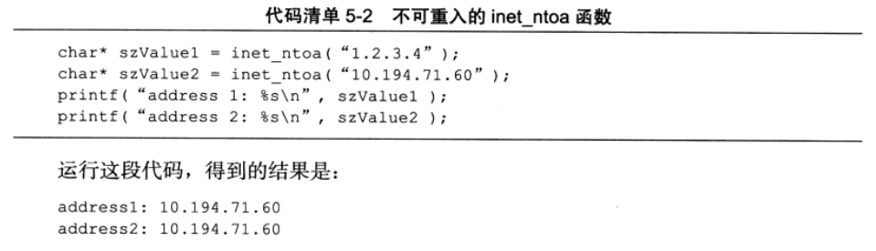

下面这对更新的函数也能完成和前面3个函数同样的功能，并且同时适用于IPv4地址和IPv6地址。

```c++
#include<arpa/inet.h>
int inet_pton(int af, const char* src, void* dst);
const char* inet_ntop(int af, const void* src, char* dst, socklen_t cnt);
```

inet_pton函数将用字符串表示的IP地址src（用点分十进制字符串表示的IPv4地址或用十六进制字符串表示的IPv6地址）转换成用网络字节序整数表示的IP地址，并把转换结果存储于dst指向的内存中。

其中，af参数指定地址族，可以是AF_INET或者AF_INET6。

inet_pton成功时返回0，失败时返回0并设置errno。

inet_ntop函数进行相反的转换，前三个参数的含义与inet_pton的参数相同，最后一个参数cnt指定目标存储单元的大小。下面两个宏能帮助指定这个大小:

```c++
#include<netinet/in.h>
#define INET_ADDRSTRLEN 16
#define INET6_ADDRSTRLEN 46
```

inet_ntop成功时返回目标存储单元的地址，失败时返回null并设置errno(linux提供众多errno一表示各种错误)。

## 5.2 创建socket

linux中所有东西都是文件。socket是可读、可写、可控制、可关闭的文件描述符。

**创建一个socket：**

```
#include<sys/types.h>
#include<sys/socket.h>
int socket(int domain, int type, int protocol);
```

- domain用来表示系统使用哪个低层协议。

  - 对于TCP/IP协议而言，设置为PF_INET（Protocol Family of Internet，用于IPv4）或PF_INET6；
  - 对于UNIX本地协议族而言，该参数应该设置为PF_UNIX。

- type参数指定服务类型。

  - 对于TCP/IP协议而言，SOCK_STREAM服务（流服务）表示传输层使用TCP协议；
  - 对于TCP/IP协议而言，SOCK_UGRAM(数据报)服务，表示使用UDP协议。

  自linux内核版本2.6.17开始，type参数可以接受上述服务类型与下面两个重要的标识相与的值：

  - SOCK_NONBLOCK：将创建的socket设置为非阻塞的
  - SOCK_CLOEXEC：用fork调用常见子进程时在子进程中关闭该socket。

- protocol参数是在前两个单数构成的协议集合下，再选择一个具体的协议。通常设置为0，表示使用默认协议。

- socket系统调用成功时返回一个socket文件描述符，失败时返回-1并设置errno。

## 5.3 命名socket

创建socket时指定了地址族，但是没有指定使用该地址族中的哪个具体socket地址，socket命名是将一个socket与socket地址绑定。

- 在服务器端，通常需要命名socket，只有命名后客户端才能直到该如何连接它。
- 在客户端通常不需要命名socket，而采用匿名的方式，即使用操作系统自己分配的socket地址。

命名socket的系统调用是bind。

```
#include<sys/types.h>
#include<sys/socket.h>
int bind(int sockfd, const struct sockaddr* my_addr, socklen_t addrlen);
```

- bind将my_addr所指的socket地址分配给未命名的sockfd文件描述符，addrlen参数指出该socket地址的长度
- bind成功时返回0，失败时返回-1并设置errno。其中两种常见的errno是EACCES和EADDRINUSE，它们的含义分别是：
  - EACCES，被绑定的地址是受保护的地址，仅超级用户能够访问。比如普通用户将socket绑定到知名服务端口（端口号为0-1023）上时，bind将返回EACCES错误。
  - EADDRINUSE，被绑定的地址正在使用中。比如将socket绑定到一个处于TIME_WAIT状态的socket地址。

## 5.4 监听socket

socket被命名之后，不能马上接受客户连接，需要使用如下系统调用来创建一个监听队列以存放待处理的客户连接：

```
#include<sys/socket.h>
int listen(int sockfd, int backlog);
```

- socket参数指定被监听的socket。
- backlog参数提示内核监听队列的最大长度。监听队列的长度如果超过backlog，服务器将不受理新的客户连接，客户端也将收到ECONNREFUSED错误消息。linux内核版本2.2之后，backlog只表示处于完全连接状态的socket的上限，处于半连接状态的socket的上限则由/proc/sys/net/ipv4/tcp_max_syn_backlog内核参数定义。backlog参数的典型值为5.
- listen成功时返回0，失败则返回-1并设置errno。

服务器程序：

```C++
#include<sys/socket.h>
#include<netinet/in.h>
#include<arpa/inet.h>
#include<signal.h>
#include<unistd.h>
#include<cstdlib>
#include<cassert>
#include<cstring>

#include<string>
#include<iostream>

static bool stop = false;
// SIGTREM的信号处理函数，触发时结束主程序中的循环
static void signal_handler(int sig){
    stop = true;
}

int main(int argc, char **argv){
    signal(SIGTERM, signal_handler);

    if (argc <= 3){
        std::cout << "usage: " << argv[0] << " ip_address port_number backlog"
            << std::endl;
        return 1;
    }
    const char* ip = argv[1];
    int port = atoi(argv[2]);
    int backlog = atoi(argv[3]);

    int sock = socket(PF_INET, SOCK_STREAM, 0);
    assert(sock >= 0);

    struct sockaddr_in address;
    memset(&address, 0, sizeof(address));
    address.sin_family = AF_INET;
    address.sin_port = htons(port);
    inet_pton(AF_INET, ip, &address.sin_addr);

    int ret = bind(sock, (struct sockaddr*)&address, sizeof(address));
    assert(ret != -1);

    // 循环等待连接，直到有SIGTERM信号将它中断
    while(!stop){
        sleep(1);
    }
    // 关闭socket
    close(sock);
    return 0;
}
```

## 5.5 接受连接

下面的系统调用从listen监听队列中接受一个连接：

```
#include<sys/types.h>
#include<sys/socket.h>
int accept(int sockfd, struct sockaddr *addr, socklen_t *addrlen);
```

- sockfd参数是执行过listen系统调用的监听socket
- addr参数用来获取被接受连接的**远端socket地址**，该socket地址的长度由addrlen参数指出。
- accept成功时返回一个新的连接socket，该socket唯一标识了被接受的这个连接，服务器可通过读写该socket来与被接受连接对应的客户端通信。
- accept失败时返回-1，并设置errno。
- accept只是从监听队列中取出连接，而不论连接处于何种状态（如ESTABLISHED状态CLOSR_WAIT状态），更不关心任何网络状况的变化。

## 5.6 发起连接

服务器通过listen调用被动接受连接，而客户端通过connect调用主动与服务器建立连接：

```c++
#include<sys/types.h>
#include<sys/socket.h>
int connect(int sockfd, const struct sockaddr *serv_addr, socklen_t addrlen);
```

- sockfd参数由socket系统调用返回一个socket。
- serv_addr参数是服务器监听的socket地址。
- addrlen参数则指定这个地址的长度。

- connect成功时返回0。一旦成功建立连接，sockfd就唯一地标识了这个连接，客户端就可以通过读写sockfd来与服务器通信。
- connect失败时则返回-1并设置errno。两种常见的errno为：
  - ECONNREUSED，目标端口不存在，连接被拒绝。
  - ETIMEDOUT，连接超时。

## 5.7 关闭连接

关闭一个连接实际上就是关闭连接所对应的socket，可以通过关闭普通文件描述符的系统调用完成：

```
#include<unistd.h>
int close(int fd);
```

- fd参数是待关闭的socket。不过，close系统调用并非总是立即关闭一个连接，而是将fd的引用计数减1。只有当fd的引用计数为0时，才真正关闭连接。多进程程序中，一次fork系统调用默认将使父进程中打开的引用技术加1。

- 如果想要立即终止连接，可以使用shutdown系统调用

  ```c++
  #include<sys/socket.h>
  int shutdown(int sockfd, int howto);
  ```

  - sockfd是待关闭的连接
  - howto参数决定了shutdown的行为。
  - 成功是返回0，失败时返回-1并设置errno。

  | 可选值    | 含义                                                         |
  | --------- | ------------------------------------------------------------ |
  | SHUT_RD   | 关闭sockfd上读的这一半。应用程序不能再针对socket文件描述符执行读操作，并且该socket接受缓冲区中的数据都被丢弃 |
  | SHUT_WR   | 关闭sockfd上写的这一半。sockfd的发送缓冲区中的数据会在真正关闭连接之前全部发送出去，应用程序不可再对该sockfd文件描述符执行写操作。这种情况下，连接处于半关闭状态。 |
  | SHUT_RDWR | 同时关闭sockfd上的读和写                                     |

## 5.8 数据读写

### 5.8.1 TCP数据读写

对文件的读写read、write同样适用于socket。

socket编程接口提供了介个专门用于socket数据读写的系统调用，增加了对数据读写的控制。

TCP流数据读写的系统调用：

```C++
#include<sys/types.h>
#include<sys/socket.h>
ssize_t recv(int sockfd, void *buf, size_t len, int flags);
ssize_t send)int sockfd, const void *buf, size_t len, int flags);
```

- recv读取sockfd上的数据，buf和len参数反别指定读缓冲区的位置和大小，flags参数的含义见后文，通常设置为0。

- recv成功时返回实际读取到的数据的长度，他可能小于期望的长度len。因此可能需要多次调用recv，才能读取到完整的数据。

- recv可能返回0，这意味着通信双方已经关闭连接了

- recv出错时返回-1并设置errno。

- send往sockfd上写数据，buf和len分别指定写缓冲区的位置和大小。

- send成功时返回实际写入的数据的长度，失败时返回-1并设置errno。

- flag参数为数据收发提供了额外的控制

  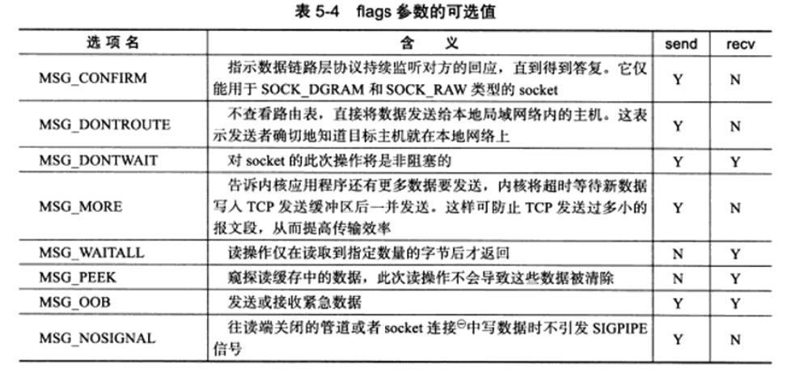

程序：


### 5.8.2 UDP数据读写

socket编程接口中用于UDP数据报读写的系统调用是：

```c++
#include<sys/types.h>
#include<sys/socket.h>
ssize_t recvfrom(int socket, void* buf, size_t len, int flags, struct sockaddr* src_addr, socklen_t* addrlen);
ssize_t sendto(int socket, const void* buf, size_t len, int flags, const struct sockaddr* dest_addr, socket_t addrlen);
```

- recvform读取sockfd上的数据，buf和len参数分别指定读缓冲区的位置和大小。因为UDP通信没有连接的概念，所以每次读取数据都需要获取发送端的socket地址，即参数src_addr所指的内容，addrlen指定该地址的长度。
- sendto往sockfd上写数据，buf和len分别是指定写缓冲区的位置和大小。dest_addr指定接收端的socket地址，addrlen参数则指定该地址的长度。
- 这两个系统调用的flags参数以及返回值的含义均与send/recv系统调用的flags参数及返回值相同。
- recvfrom/sendto系统调用也可以用于面向连接（STREAM）的socket的数据读写，只需要把最后两个参数设置为NULL以忽略发送端/接收端的socket地址。

### 5.8.3 通用数据读写函数

socket编程接口提供了一对通用的数据读写系统调用。不仅能用于TCP流数据，也能用于UDP数据报：

```c++
#include<sys/socket.h>
ssize_t recvmsg(int sockfd, struct msghdr* msg, int flags);
ssize_t sendmsg(int sockfd, struct msghdr* msg, int flags);
```

sockfd参数指定被操作的目标socket。

msg参数是msghdr结构体类型的指针，msghdr结构体的定义如下：

```
struct msghdr{
	void* msg_name;         // socket地址
	socklen_t msg_namelen;  // socket地址的长度
	struct iovec* msg_iov;  // 分散的内存块
	int msg_iovlen;         // 分散的内存块的数量
	void* msg_control;      // 指定辅助数据的起始位置
	socklen_t msg_controllen;  // 辅助数据的大小
	int msg_flags;          // 复制函数中的flags参数，并在调用过程中更新
}；
```

- msg_name成员指向一个socket地址结构变量。指定通信对方的socket地址。对于面向连接的TCP协议，该成员没有意义，必须设置为NULL。

- msg_namelen成员则指定了msg_name所指socket地址的长度。

- msg_iov成员是iovec结构体类型的指针，iovec结构体定义如下：

  ```c++
  struct iovec{
  	void *iov_base;           // 内存起始地址
  	size_t iov_len;           // 这块内存的长度
  }；
  ```

  iovec结构体封装了一块内存的起始地址和长度。msg_iovlen指定这样的iovec结构对象有多少个。

  - 对于recvmsg而言，数据将被读取并存放再msg_iovlen块分散的内存中，这些内存的位置和长度则由msg_iov指定的数组指定，这称为**分散度**；
  - 对于sendmsg而言，msg_iovlen块分散内存中的数据将被一并发送，这被称为**集中写**。

- msg_control和msg_controllen成员用于辅助数据的传送。可以实现在进程间传递文件描述符。

- msg_flags成员无须设定，他会复制recvmsg/sendmsg的flags参数的内容以影响数据读写过程。recvmsg还会在调用结束钱，将某些信息更新后的标志设置到msg_flags中。

## 5.9 带外标记

linux内核检测到TCP紧急标志时，将通知应用程序有带外标记需要接收。内核通知带外标记到来的两种常见方式是：

-  IO复用产生的异常事件
- SIGURG信号

而即使应用程序得到了有带外数据需要接收的通知，还需要知道带外数据在数据流中的具体位置，才能准确接收带外数据，可通过系统调用实现：

```
#include<sys/socket.h>
int sockatmark(int sockfd);
```

sockatmark判断sockfd是否处于带外标记，即下一个被读取到的数据是否是带外数据。

如果是，sockatmark返回1，此时可以利用带MSG_OOB标识的recv调用来接收带外数据。吐过不是，则sockatmark返回0；

## 5.10地址信息函数

如果想知道一个连接socket的本端socket地址，以及远端的socket地址。下面这两个函数可以解决：

```c++
#include<sya/socket.h>
int getsockname(int sockfd, struct sockaddr* address, socklen_t* address_len);
int getpeername(int sockfd, struct sockaddr* address, socklen_t* address_len);
```

- **getsockname获取sockfd对应的本端socket地址**，并将其存储于address参数指定的内存中，该socket地址的长度则存储于address_len参数指向的变量中。如果实际socket地址的长度大于address所指内存区的大小，那么该socket地址将被**截断**。
- getsockname成功时返回0，失败返回-1并设置errno。
- **getpeername获取sockfd对应的远端socket地址**，器参数及返回值的涵义于getsockname的参数及返回值相同。

## 5.11 socket选项

fcntl系统调用是控制文件描述符属性的通用POSIX方法，那么下列系统调用则是专门**用来读取和设置socket文件描述符属性**的方法：

```c++
#include<sys/socket.h>
int getsockopt(int sockfd, int level, int option_name, void* option_value, socklen_t* restrict option_len);
int setsockopt(int sockfd, int level, int option_name, const void* option_value, socklen_t option_len);
```

- sockfd参数指定被操作的目标socket。
- level参数指定要操作哪个协议的选项（即属性），比如IPv4，IPv6，TCP等。
- option_name参数指定选项的名字。图5-5所示
- option_value和option_len参数分别是被操作选项的值和长度。不同选项具有不同类型的值。如5-5中“数据类型”一列所示

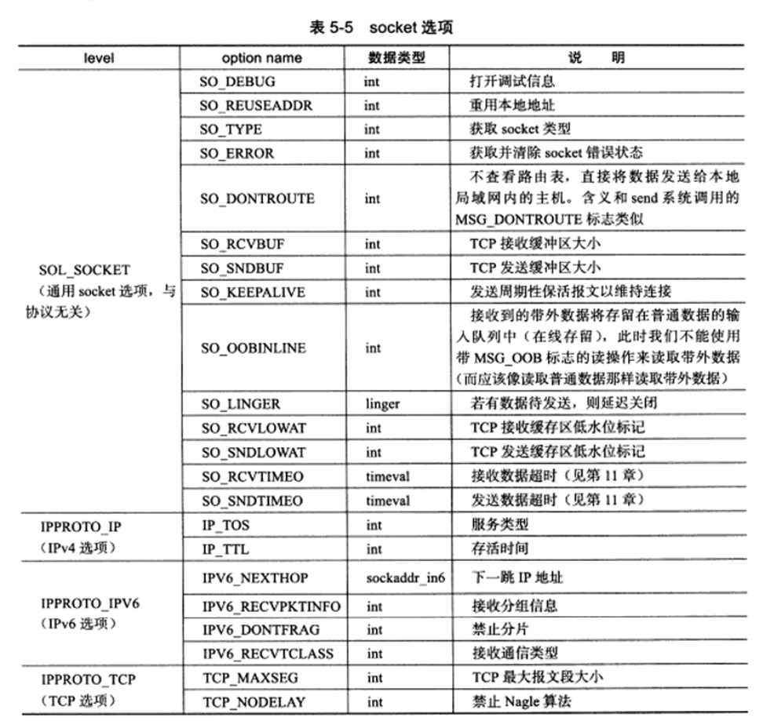

- getsockopt和setsockopt这两个函数成功时返回0，失败时返回-1并设置errno。

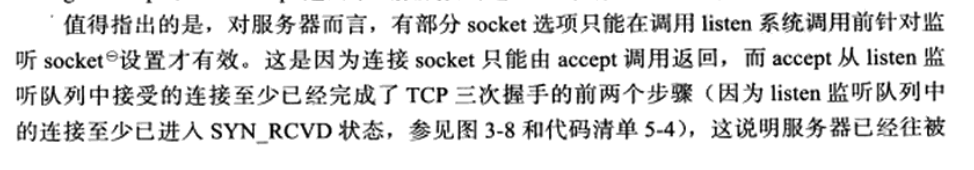

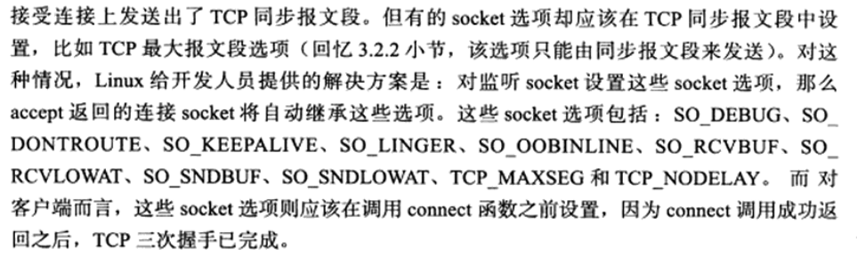

### 5.11.1 SO_REUSEADDR选项

服务器程序可以通过设置socket选项SO_REUSEADDR来强制使用被处于TIME_WAIT状态的连接占用socket地址。

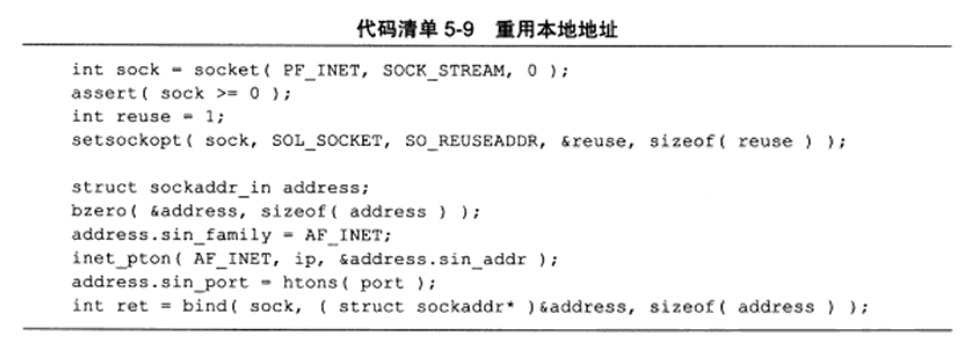

经过setsocket的设置之后，即使sock处于TIME_WAIT状态，与之绑定的socket地址也可以立即被重用。此外可以通过修改内核参数`/proc/sys/net/ipv4/tcp_te_recycle`来快速回收被关闭的socket，从而使得TCP连接根本就不进入TIME_WAIT状态，进而允许应用程序立即重用本地的socket地址。

### 5.11.2 SO_RCVBUF和SO_SNDBUF选项

SO_RCVBUF和SO_SNDBUF选项分别表示TCP接收缓冲区和发送缓冲区的大小。当用setsockopt来设置TCP的接收缓冲区和发送缓冲区的大小时，系统都会将其值加倍，并且不得小于某个最小值。TCP接收缓冲区的最小值是256字节，而发送缓冲区的最小值是2048字节。这样做主要是确保一个TCP连接有足够的空闲缓冲区来处理拥塞（快速重传算法就期望TCP接收缓冲区能至少容纳4个大小为SMSS的TCP报文段）。也可以修改内核参数`/proc/sys/net/ipv4/tcp_rmem`和`/proc/sys/net/ipv4/tcp_wmem`来强制接收缓冲区和发送缓冲区的大小没有最小值限制。

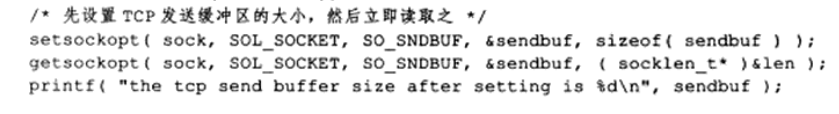

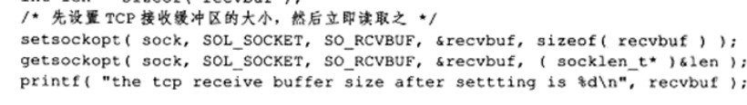

### 5.11.3 SO_RCVLOWAT和SO_SNDLOWAT选项

SO_RCVLOWAT和SO_SNDLOWAT选项分别表示TCP接收缓冲区和发送缓冲区的低水位标记。它们一般被I/O复用系统调用用来判断socket是否可读或可写。当TCP接收缓冲区可读数据的总数大于其低水位标记时，I/O复用系统调用将通知应用程序可以从对应的socket上读取数据；当TCP发送缓冲区中的空闲空间（可以写入数据的空间）大于其低水位表示时，I/O复用系统调用将通知应用程序可以往对应的socket上写入数据。

默认情况下，TCP接收缓冲区的低水位标记和TCP发送缓冲区的低水位标记均为1字节。

### 5.11.4 SO_LINGER选项

SO_LINGER选项用于控制close系统调用在关闭TCP连接时的行为。默认情况下，当使用close系统调用关闭一个socket时，close将立即返回，TCP模块负责将该socket对应的TCP发送缓冲区中残留的数据发送给对方。

设置（获取）SO_LINGER选项的值时，需要给setsockopt（getsockopt）系统调用传递一个linger类型的结构体，其定义如下：

```c++
#include<sys/socket.h>
struct linger{
	int l_onoff;   // 开启（非0）还是关闭（0）该选项
	int l_linger;  // 滞留时间
};
```

根据两个成员变量的不通知close可能产生3中行为：

- l_onoff等于0。此时SO_LINGER选项不起作用，close用默认行为来关闭socket。

- l_onoff不为0，l_linger等于0。此时close立即返回，TCP模块将丢弃被关闭的socket对应的TCP发送缓冲区中残留的数据，同时给对方发一个复位报文段。因此，这种情况给服务器提供了异常终止一个连接的方法。

- l_onoff不为0，l_linger不等于0。此时close的行为取决于两个条件

  - 一是被关闭的socket对应的TCP发送缓冲区中是否还有残留数据；
  - 二是该socket是阻塞的，还是非阻塞的。

  对于阻塞的socket，close将等待一段长为l_linger的时间，直到TCP模块发送完所有残留数据并得到对方的确认。如果这段时间内TCP模块没有发送完残留数据并得到对方的确认，那么close将返回-1并设置errno为EWOULDBLOCK。

  对于非阻塞的socket，close将立即返回，此时需要根据器返回值和errno来判断残留数据是否已经发送完毕。

## 5.12 网络信息API

较为重要的网络信息API

### 5.12.1 gethostbyname和gethostbyaddr

- gethostbyname函数根据主机名称获取主机的完整信息。
- gethostbyaddr函数根据IP地址获取主机的完整信息。

gethostbyname函数通常现在本地的`/etc/hosts`配置文件中查找主机，如果没有找到，再去访问DNS服务器。

```c++
#include<netdb.h>
struct hostent* gethostbyname(const char* name);
struct hostent* gethostbyaddr(const void* addr, size_t len, int type);
```

- name参数指定目标主机的目标名

- addr参数指定目标主机的IP地址

- len参数指定addr所指IP地址的长度

- type参数指定addr所指IP地址的类型，其合法取值包括AF_INET和AF_INET6。

- 这两个函数都返回的hostent结构体类型的指针，hostent结构体的定义如下：

  ```C++
  #include<netdb.h>
  struct hostent
  {
  	char* h_name;    // 主机名
  	char** h_aliases;   // 主机别名列表，可能有多个
  	int h_addrtype;     // 地址类型
  	int h_length;       // 地址长度
  	char** h_addr_list  // 按网络字节序列出的主机IP地址列表
  };
  ```

### 5.12.2 getservbyname和getservbyport

- getservbyname函数根据名称获取某个服务的完整信息
- getservbyport函数根据端口号获取某个服务的完整信息

两个函数实际上都是通过读取`/etc/services`文件来获取服务的信息。定义如下：

```C++
#include<netdb.h>
struct servent* getservbyname(const char* name, const char* proto);
struct servent* getservbyport(int port, const char* proto);
```

- name参数指定目标服务的名字

- port参数指定目标服务对应的端口号

- proto参数指定服务类型，给它传递“tcp”表示获取流服务，传递“udp”表示获取数据报服务，传递NULL表示获取所有类型的服务。

- 都返回servent结构体类型的指针，定义如下：

  ```c++
  #include<netdb.h>
  struct servent{
  	char* s_name;        // 服务名称
  	char** s_aliases;    // 服务的别名列表，可能有多个
  	int s_port;          // 端口号
  	char* s_proto;       // 服务类型，通常是tcp或者udp
  };
  ```

- 可重入版本的命名规则是在这些函数的函数名尾部加上`_r(re-entrant)`。

### 5.12.3 getaddrinfo

- getaddrinfo函数既能通过主机名获得IP地址（内部使用gethostbyname），也能通过服务名获得端口号（内部使用getservbyname函数）。是否可重入取决于其内部调用的gethostbyname和getservbyname函数是否是它们的可重入版本。函数定义如下

  ```
  #include<netdb.h>
  int getaddrinfo(const char* hostname, const char* service, const struct addrinfo* hints, struct addrinfo** result);
  ```

- hostname参数可以接收主机名，也可以接收字符串表示的IP地址。

- service可以接收服务名，也可以接收字符串表示的端口号。

- hints参数是应用程序给getaddrinfo的一个提示，以对getaddrinfo进行更加精确的控制。hints可以设置为NULL，表示允许getaddrinfo返回任何可用的结果。

- result参数指向一个链表，该链表用于存储getaddrinfo反馈的结果。

- getaddrinfo反馈的每一条结果都是addrinfo结构体类型的对象，结构体addrinfo的定义如下：

  ```c++
  struct addrinfo{
  	int ai_flags;   
  	int ai_family;        // 地址族
  	int ai_socktype;      // 服务类型，SOCK_STREAM或SOCK_DGRAM
  	int ai_protocol; 
  	socklen_t ai_addrlen;  // socket地址ai_addr的长度
  	char* ai_canonname;    // 主机的别名
  	struct sockaddr* ai_addr;  // 指向socket地址
  	struct addrinfo* ai_next;  // 指向下一个sockinfo结构的对象
  };
  ```

  - ai_protocol成员是指具体的网络协议，含义和socket系统调用的第三个参数相同，它通常被设置为0

  - ai_flags成员可以取表5-6中的标志的按位或。

    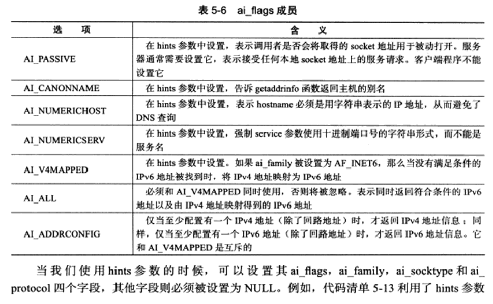

    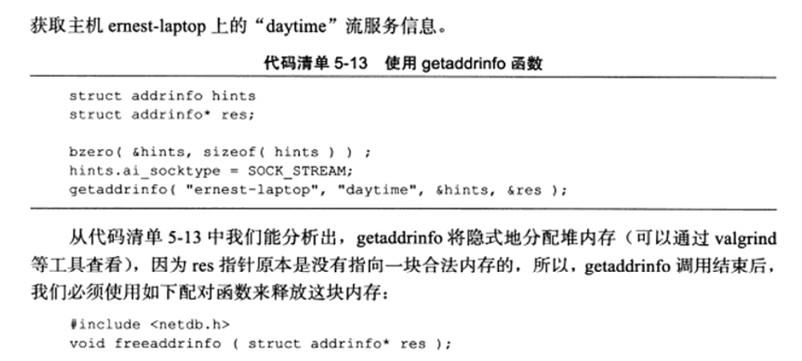

### 5.12.4 getnameinfo

getnameinfo函数能通过socket地址同时获得以字符串表示的主机名（内部使用gethostbyaddr函数）和服务名（内部使用的是getservbyport函数）。是否可重入取决于北部调用的gethostbyaddr和getservbyport函数是否是它们的可重入版本。

函数定义如下：

```C++
#include<netdb.h>
int getnameinfo(const struct sockaddr* sockaddr, socklen_t addrlen, char* host, socklen_t hostlen, char* serv, socklen_t servlen, int flags);
```

- getnameinfo将返回的主机名存储在host参数指向的缓存中，将服务名存储在serv参数指向的缓存中，hostlen和servlen参数分别指定这两块缓存的长度。flags参数控制getnameinfo的行为，可以接收表5-7中的选项。

  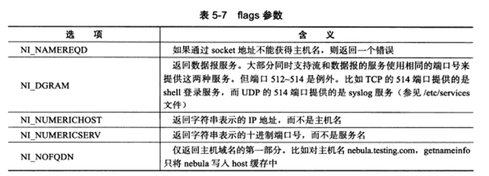

- getaddrinfo和getnameinfo函数成功时返回0， 失败则返回错误码，可能的错误码：

  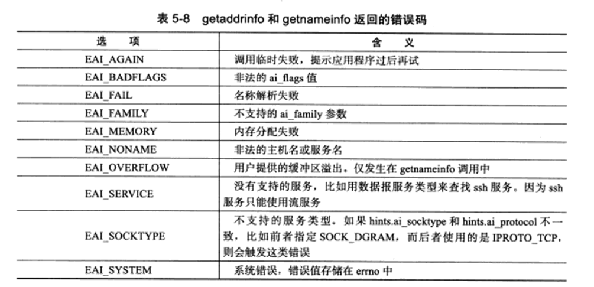

  linux下strerror函数能将数值错误码errno转换成易读的字符串形式。下面函数也可以将错误码转换成其字符串形式：

  ```
  #include<netdb.h>
  const char* gai_strerror(int error);
  ```

  
