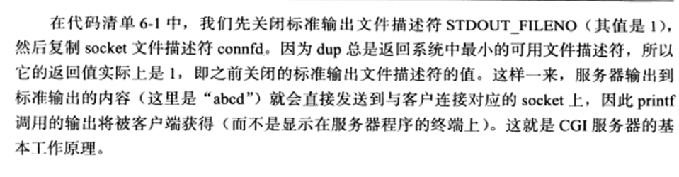
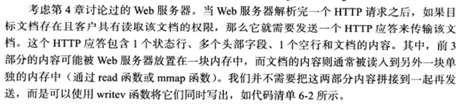
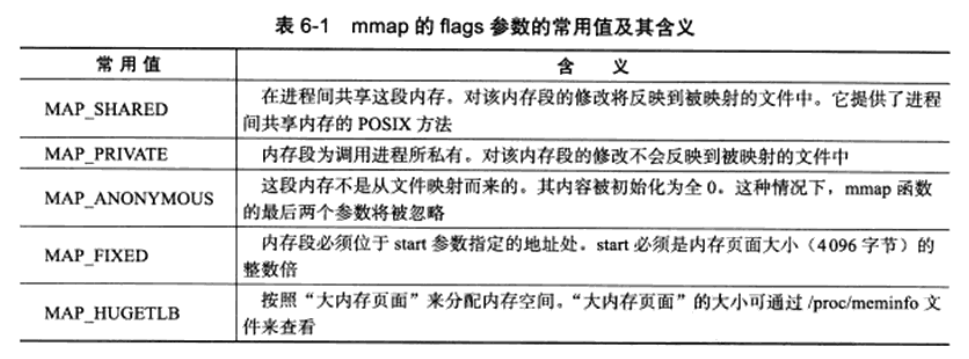
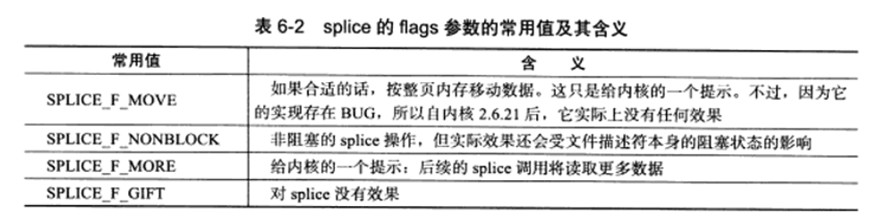
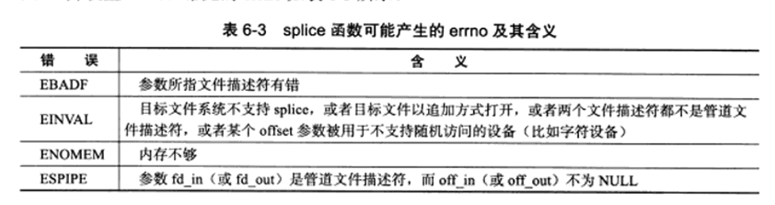
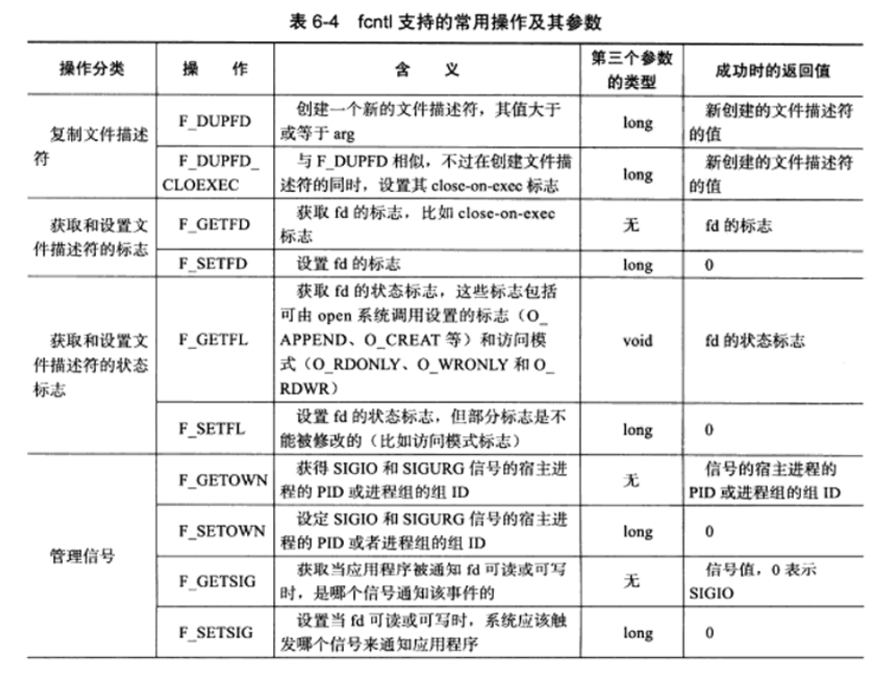
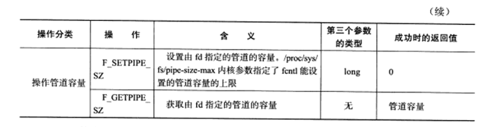
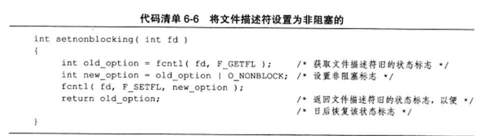
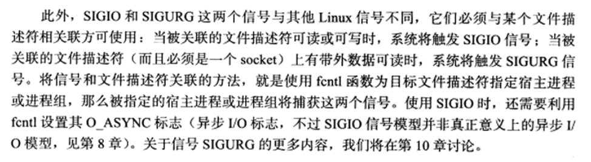

# 6 高级I/O函数

三类：

- 用于创建文件描述符的函数，包括pipe、dup/dup2函数。
- 用于读写数据的函数，包括readv/writev，sendfile、mmap/munmap、splice和tee函数。
- 用于控制I/O行为和属性的函数，包括fcntl函数。

## 6.1 pipe函数

**pipe函数可用于创建一个管道，以实现进程间通信。**定义如下：

```c++
#include<unistd.h>
int pipe(int fd[2]);
```

- pipe函数的参数是一个包含两个int型整数的数组指针。

- 成功是返回0，并将一对打开的文件描述符值填入其参数指向的数组。
- 失败返回-1并设置errno。

- 通过pipe函数创建的两个文件描述符fd[0]和fd[1]分别构成管道的两端，往fd[1]写入的数据可以从fd[0]读出，不能反过来使用。
- 要实现双向的数据传输，就应该使用两个管道。
- 默认情况下，这一对文件描述符都是阻塞的。
- 如果应用程序将fd[0]和fd[1]设置为非阻塞的，则read和write会有不同的行为。见ch8.
- 如果管道的写端文件描述符fd[1]的引用计数减少至0，即没有任何进程需要往管道中写入数据，则针对该管道的读端文件描述符fd[0]的read操作将返回0，即读取到了文件结束标记（End of File，EOF）；如果管道的读端文件描述符fd[0]的引用计数减少至0，即没有任何进程需要从管道读取数据，则针对该管道的写端文件描述符fd[1]的write操作将失败，并引发SIGPIPE信号。
- 管道内部传输的数据是字节流。管道容量的大小默认是65536字节。可以使用fctnl函数修改管道容量。

**socket的基础API中有一个socketpair函数，能够创建双向管道**。定义如下：

```C++
#include<sys/type.h>
#include<sys/socket.h>
int socketpair(int domain, int type, int protocol, int fd[2]);
```

- socketpair前三个参数的含义与socket系统调用的三个参数完全相同，但domain只能使用UNIX本地域协议族AF_UNIX，因为仅能再本地使用这个双向管道。
- 最后一个参数与pipe系统调用一样，但这对文件描述符即可读又可写。
- socketpair成功时返回0，失败时返回-1并设置errno。

## 6.2 dup函数与dup2函数

把标准输入重定向到一个文件，或者把标准输出重定向到一个网络连接（CGI编程），可以通过下面的用于复制文件描述符的dup或dup2函数来实现：

```c++
#include<unistd.h>
int dup(int file_descriptor);
int dup2(int file_descriptor_one, int file_descriptor_two);
```

- dup函数创建一个新的文件描述符，该新文件描述符和原有文件描述符file_descriptor指向相同的文件、管道、网络连接。
- dup返回的文件描述符总是取系统当前可用的最小整数值。
- dup2和dup类似，不过他将返回第一个不小于file_descriptor_two的整数值。
- dup和dup2系统调用失败返回-1并设置errno。
- 通过dup和dup2创建的文件描述符并不继承源文件描述符的属性，比如close-on-exec和non-blocking等

CGI服务器实现：




## 6.3 readv函数和weitev函数

readv函数将数据从文件描述符读到分散的内存块中，即**分散读**；writev函数将多块分散的内存数据一并写入文件描述符中，即集中写。定义如下：

```C++
#include<sys/uio.h>
ssize_t readv(int fd, const struct iovec* vector, int count);
ssize_t writev(int fd, const struct iovec* vector, int count);
```

- fd参数是被操作的目标文件描述符。
- vector参数的类型是iovec结构数组，该结构体描述一块内存区。
- count参数是vector数组的长度，即有多块内存数据需要从fd读出或写入到fd。
- readv和writev在成功时返回读出/写入fd的字节数，失败则返回-1被设置errno。相当于简化版的recvmsg和sendmsg函数。



服务器程序：


## 6.4 sendfile函数

sendfile函数在两个文件描述符之间直接传递数据（完全在内核中操作），从而避免了内核缓冲区和用户缓冲区之间的数据拷贝，效率很高，被称为**零拷贝**。定义如下：

```c++
#include<sys/sendfile.h>
ssize_t sendfile(int out_fd, int in_fd, off_t* offset, size_t count);
```

- in_fd是待读出内容的文件描述符
- out_fd是待写入内容的文件描述符。
- offset参数指定从读入文件流的那个位置开始读，如果为空，则使用读入文件流默认的起始位置。
- count参数指定在文件描述符in_fd和out_fd之间传输的字节数。
- sendfile成功时返回传输的字节数，失败则返回-1并设置errno。
- in_fd必须是一个支持类似mmap函数的文件描述符，即它必须指向真实的文件，不能是socket和管道；而out_fd必须是一个socket。
- sendfile几乎是专门为在网络上传输文件而设计的。

## 6.5 mmap函数和munmap函数

**mmap函数用于申请一段内存空间**。可以将这段内存空间作为进程间通信的共享内存。也可以直接将文件映射到其中。munmap函数则释放由mmap创建的这段内存空间。定义如下：

```C++
#include<sys/mman.h>
void* mmap(void *start, size_t length, intn prot, int flags, int fd, off_t offset);
int munmap(void *start, size_t length);
```

- start参数允许用户使用某个特定的地址作为这段内存的起始地址。如果被设置为NULL，则系统自动分配一个地址。

- length参数指定内存段的长度。

- prot参数用来设置内存段的访问权限。可以取以下几个值的按位或：

  - PROT_READ，内存段可读。
  - PROT_WRITE，内存段可写。
  - PROT_EXEC，内存段可执行。
  - PROT_NONE，内存段不能被访问。

- flags参数控制内存段内容被修改后程序的行为。可以被设置为表6-1中的某些值（仅列出常用值）的按位或（MAP_SHARED和MAP_PRIVATE是互斥的，不能同时指定）。

  

- fd参数是被映射文件对应的文件描述符。一般通过open系统调用获得。

- offset参数设置从文件的何处开始映射（对于不需要读入整个文件的情况）。

- mmap函数成功时返回指向目标内存区域的指针，失败则返回MAP_FAILED((void*)-1)并设置errno。

- munmap函数成功时返回0，失败时返回-1并设置errno。

- 13章实现进程间共享内存。

## 6.6 splice函数

splice函数用于在两个文件描述符之间移动数据，也是零拷贝操作。定义如下：

```C++
#include<fcntl.h>
ssize_t splice(int fd_in, loff_t* off_in, int fd_out, loff_t* off_out, size_t len, unsigned int flags);
```

- fd_in参数是待输入数据的文件描述符。如果fd_in是一个管道文件描述符，那么off_in参数必须被设置为NULL。如果fd_in不是一个管道文件描述符（socket），那么off_in表示从输入数据流的何处开始读取数据。

  - 此时，若off_in被设置为NULL，则表示从输入数据流的当前偏移位置读入。
  - 若off_in不为NULL，则它将指出具体的偏移位置。

- fd_out/off_out参数的含义与fd_in/off_in相同，不过用于输出数据流。

- len参数指定移动数据的长度；

- flags参数则控制数据如何移动，可以被设置为下表中的某些值的按位或。

  

- 使用splice函数，fd_in和fd_out必须至少有一个是管道文件描述符。

- splice调用成功时返回移动字节的数量。可能返回0，表示没有数据需要移动，这发生在从管道中读取数据（fd_in时管道文件描述符）而该管道没有被写入任何数据时。

- splice失败时返回-1并设置errno。常见的errno：

  

回射服务器实现：

## 6.7 tee函数

tee函数在两个管道文件描述符之间复制数据，也是零拷贝操作。它不消耗数据，因此源文件描述符上的数据仍然可以用于后续的读操作。原型如下：

```C++
#include<fcntl.h>
ssize_t tee(int fd_in, int fd_out, size_t len, unsigned int flags);
```

- tee函数参数的含义与splice相同（但fd_in和fd_out必须都是管道文件描述符）。
- tee函数成功时返回在两个文件描述符之间复制的数据数量（字节数）。返回0表示没有复制任何数据。
- tee失败时返回-1并设置errno。
- 可利用tee函数和splice函数实现linux下tee程序（同时输出数据到终端和文件的程序）的基本功能。程序：

## 6.8 fcntl函数

fcntl函数提供了对问就按描述符的各种控制操作。另外一个常见的控制文件描述符属性和行为的系统调用是ioctl，而且ioctl比fcntl能够执行更多的控制。

但是，对于控制文件描述符常用的属性和行为，fcntl函数是由POSIX规范指定的首选方法。定义如下：

```C++
#include<fcntl.h>
int fcntl(int fd, int cmd, ...);
```

- fd是被操作的文件描述符，cmd参数指定执行何种类型的操作。

- 根据操作类型的不同，该函数可能还需要第三个可选参数arg。

- fcntl函数支持的常用操作及其参数：

  

  

- fcntl函数成功时返回值如上上表最后一列所示，失败返回-1并设置errno。

- 在网络编程中，fcntl函数通常用来将一个文件描述符设置为非阻塞的。

  

  

  